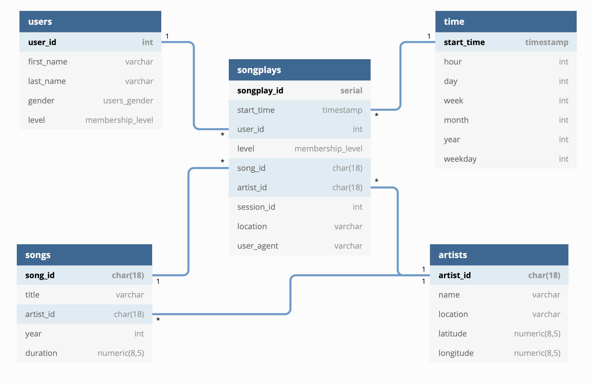

# [DEND-P1] Data Engineering Nanodegree - Project 1: Data Modeling with Postgres

## Introduction

_The content of the following section is from the project statement provided by Udacity._

>A startup called Sparkify wants to analyze the data they've been collecting on songs and user activity on their new music streaming app. The analytics team is particularly interested in understanding what songs users are listening to. Currently, they don't have an easy way to query their data, which resides in a directory of JSON logs on user activity on the app, as well as a directory with JSON metadata on the songs in their app.
>
>They'd like a data engineer to create a Postgres database with tables designed to optimize queries on song play analysis, and bring you on the project. Your role is to create a database schema and ETL pipeline for this analysis. You'll be able to test your database and ETL pipeline by running queries given to you by the analytics team from Sparkify and compare your results with their expected results.

## Project Datasets

_The content of the following section is from the project statement provided by Udacity._

### Song Dataset

> The first dataset is a subset of real data from the [Million Song Dataset](https://labrosa.ee.columbia.edu/millionsong/). Each file is in JSON format and contains metadata about a song and the artist of that song. The files are partitioned by the first three letters of each song's track ID. For example, here are filepaths to two files in this dataset.

```txt
song_data/A/B/C/TRABCEI128F424C983.json
song_data/A/A/B/TRAABJL12903CDCF1A.json
```

> And below is an example of what a single song file, TRAABJL12903CDCF1A.json, looks like.

```json
{"num_songs": 1, "artist_id": "ARJIE2Y1187B994AB7", "artist_latitude": null, "artist_longitude": null, "artist_location": "", "artist_name": "Line Renaud", "song_id": "SOUPIRU12A6D4FA1E1", "title": "Der Kleine Dompfaff", "duration": 152.92036, "year": 0}
```

### Log Dataset

> The second dataset consists of log files in JSON format generated by this [event simulator](https://github.com/Interana/eventsim) based on the songs in the dataset above. These simulate activity logs from a music streaming app based on specified configurations.

> The log files in the dataset you'll be working with are partitioned by year and month. For example, here are filepaths to two files in this dataset.

```shell
log_data/2018/11/2018-11-12-events.json
log_data/2018/11/2018-11-13-events.json
```

> And below is an example of what the data in a log file, 2018-11-12-events.json, looks like.


## Database Schema design

[](https://dbdiagram.io/d/5ecff07d39d18f5553ffe9ca)

As you can see from the diagram above (click on the image for further details) we are using a **Star schema** with `songplays` as a **fact** table and references `users`, `songs`, `artists` and `time` as **dimension** tables. 

The `songplays` fact table consists of the user activity on the music streaming app. The purpose is to analyze the songs users are listening to.

The dimension tables allows us to categorize facts and measures in order to allow the analytics team answer business questions. Using such a schema allows the team to use simplified queries and fast aggregations compared to normalized tables.

Examples of business questions and their corresponding queries that answer them are provided in the [Example queries](#example-queries) section.


**Note**: the `songs` table reference the `artists` table using `artist_id` as a foreign key. This is called an _outrigger dimensions_ and is considered a data-warehouse anti-pattern. However, this was part of the project requirements to design the schema this way. A better practice would be to relate those two dimensions using a fact table.

## ETL pipeline

The main goals of the ETL pipeline were to:

- extract the data from the `.json` files

-  transform empty string values `''` , `nan` float values and `0` values for the field _year_ to Python `None` value that would then replaced by `NULL` in the PostgreSQL tables using the **psycopg2** Python database adapter
- load the values into the tables

A detailed explanation of the ETL pipeline can be found in the [etl.ipynb](etl.ipynb) Python Notebook.


## Getting Started

The following instructions will help you set up the database, create the tables and run the ETL pipeline to populate them with the data that is stored in json format.

### Prerequisites

#### PostgreSQL, `sparkify` database and `student` user

You must have **PostgreSQL** installed on your machine.

On **macOS** use the following commands:

```shell
brew update
brew install postgresql
```

On a **Unix** system use the following:

```shell
sudo apt-get update
sudo apt-get instal postgresql postgresql-contrib
```


Furthermore, a `student` user and a `sparkify` database must be created. 

You can use the following commands to do this (enter `student` as a password when the prompted):

```shell
createuser student --createdb --pwprompt
createdb sparkify -U student
```


#### Python packages

The `psycopg2` and `pandas` packages must be installed on your machine. 

Use the [pip](https://pypi.org/project/pip/) package installer to install these:

```shell
pip3 install psycopg2 pandas
```


#### Create table and run ETL

1. Create the tables in the `sparkify` database by running the `create_tables.py` Python 3 script:

```shell
python3 create_tables.py
```

2. Run the ETL pipelines to populate the newly created tables by running  `etl.py` Python 3 script:

```shell
python3 etl.py
```

​	Alternatively, you can run the cells in the `etl.ipynb` if you prefer to go through the code step by step.


## Running the tests

To check that the database was properly created you can run the cells in the `test.ipynb`. This Python Notebook connects to the local `sparkify` database using the `student ` use. It then displays the first 5 rows for each table.


## Example queries

An [`example_queries.ipynb`](example_queries.ipynb) Python Notebook provides example queries with the expected output results.


## License

**DISCLAIMER:** This project is part of the Data Engineering Nanodegree Program from Udacity. You must abide by [Udacity's Honor of Code](https://udacity.zendesk.com/hc/en-us/articles/210667103-What-is-the-Udacity-Honor-Code-), and in particular, you must submit your own work or attribute my code if you want to use part of my solution.

The project is released under the MIT License. See the [LICENSE.md](https://github.com/nasseredine/udacity-dend-p1/blob/master/LICENSE.md) file for details.

Copyright (c) 2020 Nasseredine Bajwa.

